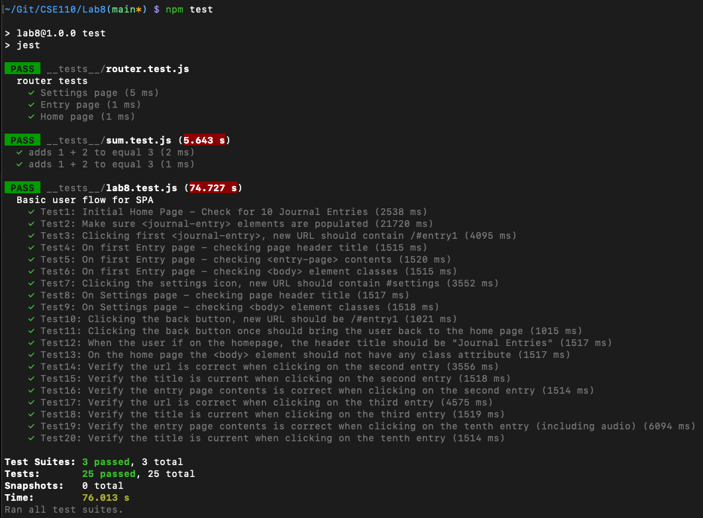

# Lab8_Starter

## Authors

Bryce Tsuyuki

## `npm test` Screenshot



## Check your understanding q's (FILL OUT)

1. In your own words: Where would you fit your automated tests in your Bujo project development pipeline? (just write the letter)

    Answer: 1

2. Would you use a unit test to test the “message” feature of a messaging application? Why or why not? For this question, assume the “message” feature allows a user to write and send a message to another user.

    Answer: No because this probably involves multiple functions and capabilities: composing the message, saving it, etc. This is outside the scope of unit testing, which is usually used to test individual functions and other small parts of code.

3. Would you use a unit test to test the “max message length” feature of a messaging application? Why or why not? For this question, assume the “max message length” feature prevents the user from typing more than 80 characters

    Answer: Yes, you could use a unit test to test this particular feature because it likely only involves a few functions that can be tested together. For example you could expect the maximum length of a message longer than 80 characters to be 80 characters since it would be truncated or trimmed.

4. What do you expect to happen if we run our puppeteer tests with the field “headless” set to true?

    Answer: If we run puppeteer tests with `headless` set to `true` then the browser will not be shown while we run our tests. This means that we will not see the framework automatically interacting with our webpage while the tests are running. The tests will just occur automatically in the background outside of our vision, and then the results will be reported at the end.

5. What would your beforeAll callback look like if you wanted to start from the settings page before every test case?

    Answer: We need to click on the settings page to go to it from the home page after we wait for the timeout. We also need to use `beforeEach` instead of `beforeAll` to make sure that it runs before every test. The code to do that is in the following snippet:

    ```js
    beforeEach(async () => {
        await page.goto('http://127.0.0.1:5500');
        await page.waitForTimeout(500);
        await page.click("header > img");
    });
    ```
